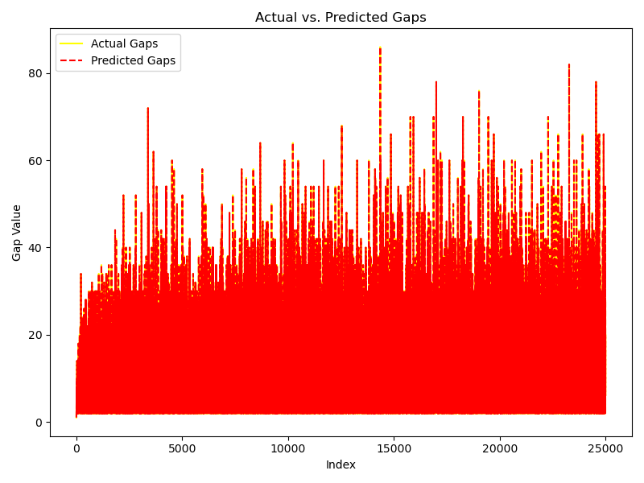

# Hybrid Prime Gap Predictor

**Spectral-Entropy-Guided Domain-Weighted Regression for Microsecond-Scale Prime Discovery**

**If you find this project useful, please consider starring and forking it on GitHub so others can discover it too.**

---

## Overview

This project demonstrates a small-scale framework for predicting prime gaps using
a combination of domain-weighted regression and spectral entropy cues.
The code generates prime and composite sequences, smooths the raw gaps and fits a
non-negative regression model to produce interpretable predictions.



---

## Installation

```bash
python3 -m venv venv
source venv/bin/activate    # macOS/Linux
venv\Scripts\activate      # Windows
pip install -r requirements.txt
```

---

## Usage

Run the default simulation:

```bash
python simulate.py --config configs/default.yaml
```

The repository also contains `predict_gaps.py` with the main class used to build
and apply the hybrid model.

**Example LaTeX expression:**

```latex
\[
\tilde{\mathcal{V}}_{x_n^{(i)}} = \frac{\displaystyle \int_{\aleph_0}^{2^{\aleph_0}} dx}{X_n} = \frac{100\%}{X_n}
\]
```

---

## Project Structure

```
spectral-entropy-prime-predictor/
├── LICENSE
├── README.md
├── requirements.txt
├── simulate.py
├── predict_gaps.py
├── src/
│   └── your_module.py
├── configs/
│   └── default.yaml
├── tests/
│   └── test_basic.py
└── .github/
    └── workflows/
        └── ci.yml
```

- **simulate.py** – entry point for simple simulations.
- **predict_gaps.py** – regression model used for prime gap prediction.
- **src/** – supporting modules.
- **configs/** – YAML configuration files.
- **tests/** – minimal unit tests.
- **.github/workflows/ci.yml** – Continuous Integration pipeline.

---
## Get Involved

Contributions are welcome! Check out [CONTRIBUTING.md](CONTRIBUTING.md) for guidelines.

## License

This project is licensed under the MIT License. See [LICENSE](LICENSE) for details.
